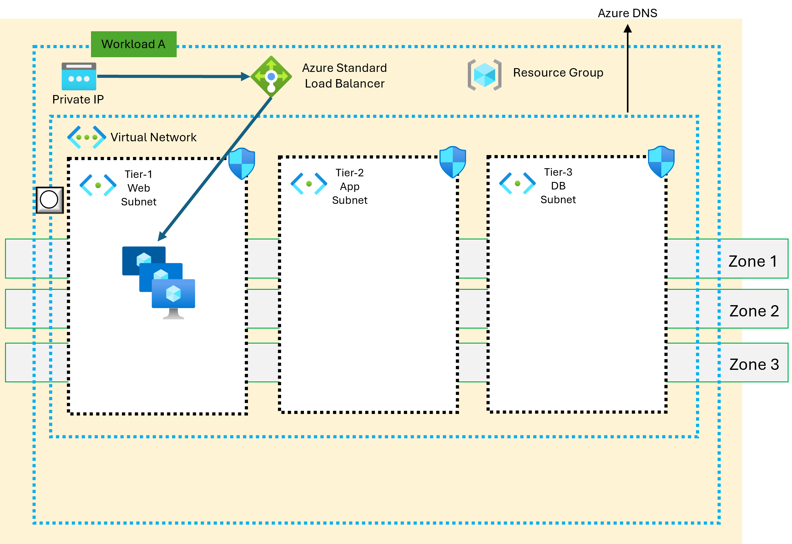

<!-- BEGIN_TF_DOCS -->
<!-- BEGIN\_TF\_DOCS -->
> [!IMPORTANT]
[!IMPORTANT]
> This script utilizes the Azure Verified Modules (AVM) and can be leveraged in all types of environments (e.g., development, testing, production, etc.). The input parameters provided in this repository are examples only. Anyone referring to this repository should carefully review their specific needs and adjust the parameters accordingly to meet their requirements.

> The author assumes no responsibility for any breaking changes that may occur. Any feedback or issues related to the AVM should be reported to the respective module's GitHub repository.
>

### Resuming Existing Resources, Creating VM Scale Set, and Load Balancer

### Architecture Overview

The proposed architecture involves reusing a virtual network (VNET) in Azure, along with subnets within that VNET. Network security groups (NSGs). Creating a VM Scale Set, and configuring a Load Balancer to distribute traffic across the VM instances.



# Refer existing state file as data block.
The proposed architecture refer existing VNET state and provision VM Scale Set and Load balancer in the same Resource Group where VNET is provisioned.

### Terraform Script and Azure Verify Module

Terraform script to automate the creation of these resources. The Azure Verify Module can be used to validate the configuration of these resources against predefined rules and best practices. This ensures that the deployed infrastructure aligns with your desired security and compliance requirements.

### Additional Considerations

**State Management:** The state management for this layer is separate. Ensure that your Terraform configuration properly handles state management, such as using a remote backend or a suitable state storage mechanism.

**Best Practices:** Follow Azure best practices for VNET, subnet, NSG, and NSG rule configuration. This includes using appropriate naming conventions, considering subnet size and addressing, and applying granular security policies.

**Testing and Validation:** Thoroughly test your Terraform script to ensure it creates the desired resources correctly. Use tools like Terraform plan and Terraform apply to preview and execute changes. Consider using Azure Verify Module to validate the deployed resources against best practices.

```hcl
# This is the module call

data "terraform_remote_state" "vnet" {
  backend = "local" # Change as per your backend configuration
  config = {
    path = "../avm-workload-vnet/terraform.tfstate" # This should point to the saved vWAN state file
  }
}

locals {
  #   #   vnet_id_parts       = split("/", data.terraform_remote_state.vnet.outputs.vnet_id)
  #   #   resource_group_name = local.vnet_id_parts[4] # 5th element is the resource group name
  #   vnet_id_parts       = split("/", data.terraform_remote_state.vnet.resources[0].instances[0].attributes.id)
  #   resource_group_name = local.vnet_id_parts[4]

  #   location        = data.terraform_remote_state.vnet.outputs.location
  #   subnet_id_parts = split("/", data.terraform_remote_state.vnet.outputs.subnet_id)
  #   subnet_id       = local.subnet_id_parts[10]

  tags = {
    scenario = "VMSS Autoscale Linux AVM Sample"
  }
}

module "naming" {
  source  = "Azure/naming/azurerm"
  version = "0.4.1"
}

resource "tls_private_key" "example_ssh" {
  algorithm = "RSA"
  rsa_bits  = 4096
}


module "terraform_azurerm_avm_res_compute_virtualmachinescaleset" {
  source              = "Azure/avm-res-compute-virtualmachinescaleset/azurerm"
  version             = "0.3.0"
  name                = module.naming.virtual_machine_scale_set.name_unique
  resource_group_name = data.terraform_remote_state.vnet.outputs.resource_group_name
  #enable_telemetry    = var.enable_telemetry
  location                    = data.terraform_remote_state.vnet.outputs.location
  admin_password              = "P@ssw0rd1234!"
  instances                   = 2
  sku_name                    = "Standard_DS1_v2"
  extension_protected_setting = {}
  user_data_base64            = null
  boot_diagnostics = {
    storage_account_uri = "" # Enable boot diagnostics
  }
  admin_ssh_keys = [(
    {
      id         = tls_private_key.example_ssh.id
      public_key = tls_private_key.example_ssh.public_key_openssh
      username   = "azureuser"
    }
  )]
  network_interface = [{
    name = "VMSS-NIC"
    # network_security_group_id = azurerm_network_security_group.nic.id
    ip_configuration = [{
      name                                    = "VMSS-IPConfig"
      subnet_id                               = data.terraform_remote_state.vnet.outputs.subnet_all.webtier.resource_id
      load_balancer_backend_address_pools_ids = [module.loadbalancer.azurerm_lb.id]
    }]
  }]
  os_profile = {
    custom_data = base64encode(local.webvm_custom_data)
    linux_configuration = {
      disable_password_authentication = false
      #   user_data_base64                = base64encode(file("user-data.sh"))
      admin_username = "azureuser"
      admin_ssh_key  = toset([tls_private_key.example_ssh.id])
    }
  }
  source_image_reference = {
    publisher = "Canonical"
    offer     = "0001-com-ubuntu-server-jammy"
    sku       = "22_04-LTS-gen2" # Auto guest patching is enabled on this sku.  https://learn.microsoft.com/en-us/azure/virtual-machines/automatic-vm-guest-patching
    version   = "latest"
  }
  extension = [{
    name                        = "HealthExtension"
    publisher                   = "Microsoft.ManagedServices"
    type                        = "ApplicationHealthLinux"
    type_handler_version        = "1.0"
    auto_upgrade_minor_version  = true
    failure_suppression_enabled = false
    settings                    = "{\"port\":80,\"protocol\":\"http\",\"requestPath\":\"/index.html\"}"
  }]
  tags = local.tags

}

data "azurerm_virtual_machine_scale_set" "private_ip_address" {
  name                = module.naming.virtual_machine_scale_set.name_unique
  resource_group_name = data.terraform_remote_state.vnet.outputs.resource_group_name
}

output "private_ip_addresses" {
  value = flatten([for instance in data.azurerm_virtual_machine_scale_set.private_ip_address.instances : instance.private_ip_address])
}

module "loadbalancer" {
  source              = "Azure/avm-res-network-loadbalancer/azurerm"
  version             = "0.2.2"
  name                = "internal-lb"
  location            = data.terraform_remote_state.vnet.outputs.location
  resource_group_name = data.terraform_remote_state.vnet.outputs.resource_group_name

  # Virtual Network and Subnet for Internal LoadBalancer
  # frontend_vnet_resource_id   = azurerm_virtual_network.example.id
  frontend_subnet_resource_id = data.terraform_remote_state.vnet.outputs.subnet_all.webtier.resource_id

  # Frontend IP Configuration
  frontend_ip_configurations = {
    frontend_configuration_1 = {
      name                                   = "myFrontend"
      frontend_private_ip_subnet_resource_id = data.terraform_remote_state.vnet.outputs.subnet_all.webtier.resource_id
      # zones = ["1", "2", "3"] # Zone-redundant
      # zones = ["None"] # Non-zonal
    }
  }

  # Backend Address Pool
  backend_address_pools = {
    pool1 = {
      name = "myBackendPool"
    }
  }

  backend_address_pool_addresses = {
    address1 = {
      name                             = "vmss1" # must be unique if multiple addresses are used
      backend_address_pool_object_name = "pool1"
      ip_address                       = data.azurerm_virtual_machine_scale_set.private_ip_address.instances[0].private_ip_address
      virtual_network_resource_id      = data.terraform_remote_state.vnet.outputs.vnet_id.vnet.resource_id
    }
    address2 = {
      name                             = "vmss2" # must be unique if multiple addresses are used
      backend_address_pool_object_name = "pool1"
      ip_address                       = data.azurerm_virtual_machine_scale_set.private_ip_address.instances[1].private_ip_address
      virtual_network_resource_id      = data.terraform_remote_state.vnet.outputs.vnet_id.vnet.resource_id
    }
  }


  # Health Probe(s)
  lb_probes = {
    tcp1 = {
      name     = "myHealthProbe"
      protocol = "Tcp"
    }
  }

  # Load Balaner rule(s)
  lb_rules = {
    http1 = {
      name                           = "myHTTPRule"
      frontend_ip_configuration_name = "myFrontend"

      backend_address_pool_object_names = ["pool1"]
      protocol                          = "Tcp"
      frontend_port                     = 80
      backend_port                      = 80

      probe_object_name = "tcp1"
      //backend_address_pool_id = azurerm_lb_backend_address_pool.app_lb_backend_address_pool.id 
      idle_timeout_in_minutes = 15
      enable_tcp_reset        = true
    }
  }
}

```

<!-- markdownlint-disable MD033 -->
## Requirements

The following requirements are needed by this module:

- <a name="requirement_terraform"></a> [terraform](#requirement\_terraform) (~> 1.7)

- <a name="requirement_azurerm"></a> [azurerm](#requirement\_azurerm) (~> 3.108)

- <a name="requirement_random"></a> [random](#requirement\_random) (~> 3.6)

## Resources

The following resources are used by this module:

- [tls_private_key.example_ssh](https://registry.terraform.io/providers/hashicorp/tls/latest/docs/resources/private_key) (resource)
- [azurerm_virtual_machine_scale_set.private_ip_address](https://registry.terraform.io/providers/hashicorp/azurerm/latest/docs/data-sources/virtual_machine_scale_set) (data source)
- [terraform_remote_state.vnet](https://registry.terraform.io/providers/hashicorp/terraform/latest/docs/data-sources/remote_state) (data source)

<!-- markdownlint-disable MD013 -->
## Required Inputs

No required inputs.

## Optional Inputs

No optional inputs.

## Outputs

The following outputs are exported:

### <a name="output_private_ip_addresses"></a> [private\_ip\_addresses](#output\_private\_ip\_addresses)

Description: n/a

## Modules

The following Modules are called:

### <a name="module_loadbalancer"></a> [loadbalancer](#module\_loadbalancer)

Source: Azure/avm-res-network-loadbalancer/azurerm

Version: 0.2.2

### <a name="module_naming"></a> [naming](#module\_naming)

Source: Azure/naming/azurerm

Version: 0.4.1

### <a name="module_terraform_azurerm_avm_res_compute_virtualmachinescaleset"></a> [terraform\_azurerm\_avm\_res\_compute\_virtualmachinescaleset](#module\_terraform\_azurerm\_avm\_res\_compute\_virtualmachinescaleset)

Source: Azure/avm-res-compute-virtualmachinescaleset/azurerm

Version: 0.3.0

<!-- markdownlint-disable-next-line MD041 -->
## Data Collection

AVM collect information about you and your use for more details refer to https://azure.github.io/Azure-Verified-Modules/
<!-- END_TF_DOCS -->