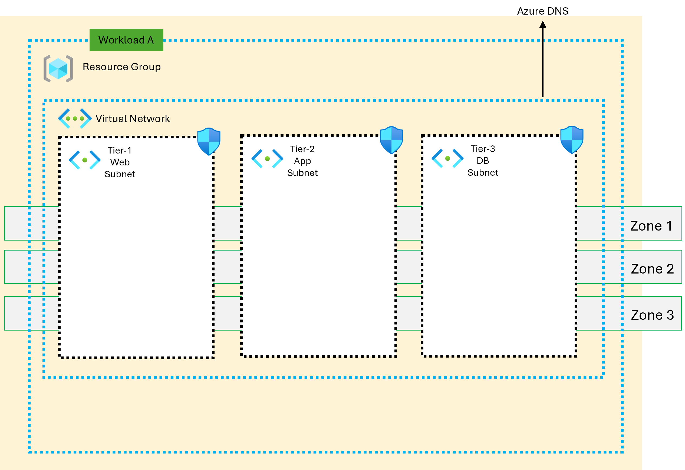

<!-- BEGIN_TF_DOCS -->
<!-- BEGIN\_TF\_DOCS -->
> [!IMPORTANT]
[!IMPORTANT]
> This script utilizes the Azure Verified Modules (AVM) and can be leveraged in all types of environments (e.g., development, testing, production, etc.). The input parameters provided in this repository are examples only. Anyone referring to this repository should carefully review their specific needs and adjust the parameters accordingly to meet their requirements.

> The author assumes no responsibility for any breaking changes that may occur. Any feedback or issues related to the AVM should be reported to the respective module's GitHub repository.
>

### Creating VNET, Subnet, NSG, NSG Rule, and Associating NSG to Subnet as Layer 1

### Architecture Overview

The proposed architecture involves creating a virtual network (VNET) in Azure, along with subnets within that VNET. Network security groups (NSGs) are then defined to control network traffic in and out of these subnets. NSG rules (sample) are configured within the NSGs to specify the allowed or denied traffic. Finally, the NSGs are associated with the respective subnets to enforce the defined network security policies.


### Terraform Script and Azure Verify Module

Terraform script to automate the creation of these resources. The Azure Verify Module can be used to validate the configuration of these resources against predefined rules and best practices. This ensures that the deployed infrastructure aligns with your desired security and compliance requirements.

### Additional Considerations

**State Management:** The state management for this layer is separate. Ensure that your Terraform configuration properly handles state management, such as using a remote backend or a suitable state storage mechanism.

**Best Practices:** Follow Azure best practices for VNET, subnet, NSG, and NSG rule configuration. This includes using appropriate naming conventions, considering subnet size and addressing, and applying granular security policies.

**Testing and Validation:** Thoroughly test your Terraform script to ensure it creates the desired resources correctly. Use tools like Terraform plan and Terraform apply to preview and execute changes. Consider using Azure Verify Module to validate the deployed resources against best practices.

```hcl
#create resource group

module "resource_group" {
  source   = "Azure/avm-res-resources-resourcegroup/azurerm"
  version  = "0.1.0"
  name     = local.resource_group_name
  location = local.location
}

#create virtual network
module "pv-resolver-virtualnetwork" {
  source              = "Azure/avm-res-network-virtualnetwork/azurerm"
  version             = "0.4.0"
  for_each            = local.virtual_network
  address_space       = [each.value.address_space]
  location            = local.location
  name                = each.value.name
  resource_group_name = local.resource_group_name

  depends_on = [module.resource_group]
}

module "subnet" {
  source = "Azure/avm-res-network-virtualnetwork/azurerm//modules/subnet"

  virtual_network = {
    resource_id = module.pv-resolver-virtualnetwork["vnet"].resource_id
  }
  for_each         = local.subnet
  name             = each.value.name
  address_prefixes = [each.value.address_prefixes]
  depends_on       = [module.pv-resolver-virtualnetwork]
}

module "nsg" {
  source              = "Azure/avm-res-network-networksecuritygroup/azurerm"
  version             = "0.2.0"
  for_each            = toset(local.nsg_name)
  name                = each.key
  resource_group_name = local.resource_group_name
  location            = local.location
  security_rules      = local.nsg_rules
}

# Associate NSG and Subnet
resource "azurerm_subnet_network_security_group_association" "ag_subnet_nsg_associate" {
  network_security_group_id = module.nsg["websubnet-nsg"].resource_id
  # Every NSG Rule Association will disassociate NSG from Subnet and Associate it, so we associate it only after NSG is completely created 
  #- Azure Provider Bug https://github.com/terraform-providers/terraform-provider-azurerm/issues/354  
  subnet_id = module.subnet.webtier.resource_id

}
```

<!-- markdownlint-disable MD033 -->
## Requirements

The following requirements are needed by this module:

- <a name="requirement_terraform"></a> [terraform](#requirement\_terraform) (~> 1.7)

- <a name="requirement_azurerm"></a> [azurerm](#requirement\_azurerm) (~> 3.108)

- <a name="requirement_random"></a> [random](#requirement\_random) (~> 3.6)

## Resources

The following resources are used by this module:

- [azurerm_subnet_network_security_group_association.ag_subnet_nsg_associate](https://registry.terraform.io/providers/hashicorp/azurerm/latest/docs/resources/subnet_network_security_group_association) (resource)

<!-- markdownlint-disable MD013 -->
## Required Inputs

No required inputs.

## Optional Inputs

No optional inputs.

## Outputs

The following outputs are exported:

### <a name="output_location"></a> [location](#output\_location)

Description: n/a

### <a name="output_resource_group_name"></a> [resource\_group\_name](#output\_resource\_group\_name)

Description: n/a

### <a name="output_subnet_all"></a> [subnet\_all](#output\_subnet\_all)

Description: n/a

### <a name="output_vnet_id"></a> [vnet\_id](#output\_vnet\_id)

Description: n/a

## Modules

The following Modules are called:

### <a name="module_nsg"></a> [nsg](#module\_nsg)

Source: Azure/avm-res-network-networksecuritygroup/azurerm

Version: 0.2.0

### <a name="module_pv-resolver-virtualnetwork"></a> [pv-resolver-virtualnetwork](#module\_pv-resolver-virtualnetwork)

Source: Azure/avm-res-network-virtualnetwork/azurerm

Version: 0.4.0

### <a name="module_resource_group"></a> [resource\_group](#module\_resource\_group)

Source: Azure/avm-res-resources-resourcegroup/azurerm

Version: 0.1.0

### <a name="module_subnet"></a> [subnet](#module\_subnet)

Source: Azure/avm-res-network-virtualnetwork/azurerm//modules/subnet

Version:

<!-- markdownlint-disable-next-line MD041 -->
## Data Collection

AVM collect information about you and your use for more details refer to https://azure.github.io/Azure-Verified-Modules/
<!-- END_TF_DOCS -->