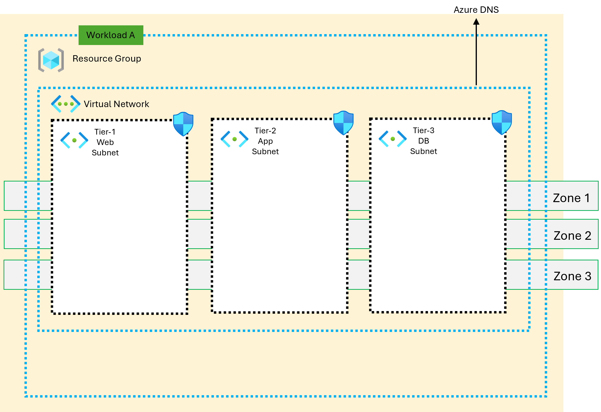

<!-- BEGIN_TF_DOCS -->
> [!IMPORTANT]
[!IMPORTANT]
> This script utilizes the Azure Verified Modules (AVM) and can be leveraged in all types of environments (e.g., development, testing, production, etc.). The input parameters provided in this repository are examples only. Anyone referring to this repository should carefully review their specific needs and adjust the parameters accordingly to meet their requirements.

> The author assumes no responsibility for any breaking changes that may occur. Any feedback or issues related to the AVM should be reported to the respective module's GitHub repository.
> 

### Creating VNET, Subnet, NSG, NSG Rule,Associating NSG to Subnet, VM Scale Set and Load Balancer as Layer

### Architecture Overview

The proposed architecture involves creating a virtual network (VNET) in Azure, along with subnets within that VNET. Network security groups (NSGs) are then defined to control network traffic in and out of these subnets. NSG rules (sample) are configured within the NSGs to specify the allowed or denied traffic. NSGs are associated with the respective subnets Finally, the create VM Scale set and Load Balancer

### Terraform Script and Azure Verify Module

Terraform script to automate the creation of these resources. The Azure Verify Module can be used to validate the configuration of these resources against predefined rules and best practices. This ensures that the deployed infrastructure aligns with your desired security and compliance requirements.

### Additional Considerations

**State Management:** The state management for this layer is separate. Ensure that your Terraform configuration properly handles state management, such as using a remote backend or a suitable state storage mechanism.

**Best Practices:** Follow Azure best practices for VNET, subnet, NSG, and NSG rule configuration. This includes using appropriate naming conventions, considering subnet size and addressing, and applying granular security policies.

**Testing and Validation:** Thoroughly test your Terraform script to ensure it creates the desired resources correctly. Use tools like Terraform plan and Terraform apply to preview and execute changes. Consider using Azure Verify Module to validate the deployed resources against best practices.
